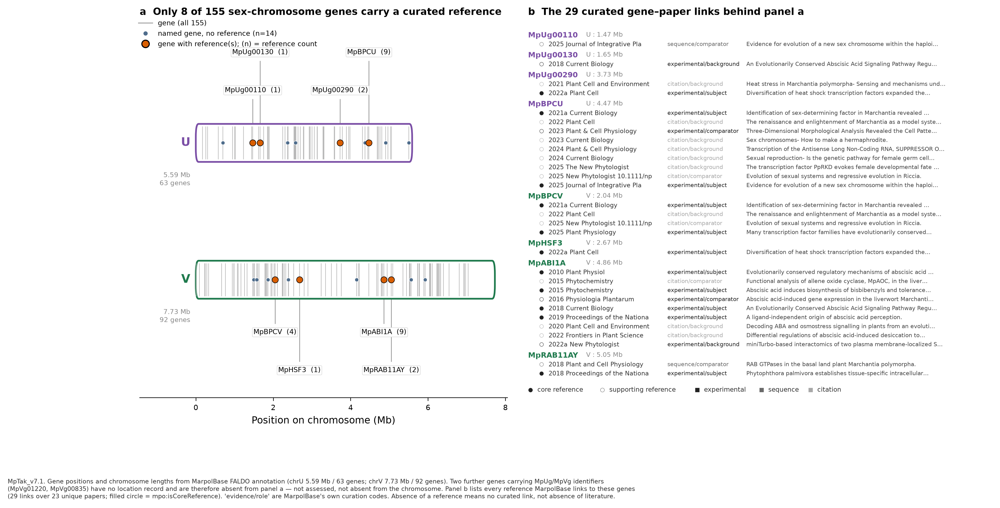

*本稿は BioHackrXiv 提出版 `paper.md` の日本語版である。*

# はじめに

ゼニゴケ (*Marchantia polymorpha*; Bowman et al., 2017) は、新世代のモデル植物として発生
生物学・進化生物学の分野で注目を集めており、高精度な参照ゲノム配列が決定されている
(Tanizawa et al., 2025)。生物情報学の観点からは、さらにもう一つの利点がある。遺伝子命名ルール
と遺伝子 ID システムが整備されており、多くの研究者が論文中で遺伝子を記載する際にこのシステムを
用いている。そのため、文献中に現れる遺伝子を、多くの生物種の場合よりはるかに曖昧さ少なく ID に
対応づけられる。これは文献からの情報抽出とデータ統合の双方において優位性となる。

この生物種のゲノムデータベース **MarpolBase** は *Plant and Cell Physiology* 誌に発表され
(Tanizawa et al., 2025)、Editor's Choice に選出された。あわせて、ゼニゴケを利用しやすい
モデル系たらしめているコミュニティ構築型リソースの一つとして位置づける Commentary が
寄稿されている (Boxall and Haseloff, 2026)。

本プロジェクトの目標は、このデータベースを知識ベース化することである。具体的には、遺伝子・発現・文献のデータを RDF として公開し、
SPARQL エンドポイントを通じて提供し、さらに Model Context Protocol (MCP) サーバを介して
AI エージェントから利用できるようにした。

その背後にある問いは実務的なものである。ゼニゴケは主要な横断参照ハブに索引されていないため、
種特異的なリソースをライフサイエンスの広いデータベース群と連結できるかどうか自体が自明では
ない。以下の多くは、その接合点が**どこで**成立するのかについての報告である。

本ハッカソンで作成したリソースとツールを表 1 に示す。

表 1: BioHackathon 2026 で開発・拡張したリソースとツール

| 名称 | URL | 説明 |
| ---- | --- | ---- |
| MarpolBase RDF | <https://marchantia.info/rdf/> | MarpolBase の遺伝子・発現・文献データの RDF 配布 |
| MarpolBase SPARQL エンドポイント | <https://marchantia.info/sparql> | 公開エンドポイント。TogoMCP と RDF Portal に登録済み |
| MarpolBase MCP サーバ | <https://marchantia.info/mcp> | 遺伝子・発現・共発現・文献への型付きアクセスを提供する 14 ツール |

# MarpolBase の RDF 化と MCP サーバ

## 公開したもの

MarpolBase が提供する遺伝子情報・発現情報・文献情報を RDF に変換して公開した。SPARQL
エンドポイントは TogoMCP (Kinjo et al., 2026) と RDF Portal の双方に登録したため、国内で
整備されているデータベース横断のクエリ環境から MarpolBase に到達できるようになった。さらにエンドポイントの
上に 14 個のツールを持つ MCP サーバを構築し、LLM エージェントが SPARQL を自分で書かずに
このリソースを検索できるようにした。

ツールは大きく五つに分かれる。遺伝子の取得と検索、発現プロファイルと条件間比較、共発現
ネットワーク、キュレーション済みの遺伝子–文献リンク、統制語彙の解決である。型付きツールで
足りない場合に備えて `run_sparql` と `describe_schema` も用意し、エージェントが生の SPARQL に
フォールバックできるようにしてある。

遺伝子 ID システムの利点が最もよく効いているのが文献の層であり、これについては次節で述べる。
遺伝子–論文リンクも LLM による機能要約も RDF に含めてあるので、エージェントは論文を読み直す
のではなくデータとして取得できる。

## 文献と遺伝子の紐付け

遺伝子–文献の層は別途構築し、MarpolBase に取り込んだ。パイプラインは四段階である。

1. 参照リストを PDF から抽出し、各論文の DOI・PubMed ID・PMC ID を CrossRef と NCBI
   E-utilities で補完した。対象は **1,399 報**である。
2. 各論文の全文 (全文を入手できないものは要約のみ) を読み、本文中で言及されているゼニゴケ
   遺伝子を同定した。得られたレコードのうち 3,020 件は全文由来、88 件は全文＋補足ファイル
   由来で、要約のみに依拠するものは 39 件にとどまる。
3. 各 (遺伝子, 論文) の組に二軸のタグを付けた。**evidence** (`experimental` / `sequence` /
   `citation`) と **role** (`subject` / `tool` / `comparator` / `background`) であり、あわせて
   本文から起こした 2〜3 行の機能注記を付与した。`experimental` かつ `subject` の組を
   **core reference** とする — その遺伝子を実際に実験的に扱った論文である。遺伝子ページでは
   core を既定表示とし、周辺的な言及は「More」の内側に置く。
4. 遺伝子 ID を MpTak_v7.1 アセンブリに正規化し、MarpolBase 取込用の遺伝子別 JSON を生成した。

結果として、**510 報が少なくとも一つの遺伝子リンクを持ち**、**3,147 件の遺伝子–論文レコード**
が得られた。そこに現れる遺伝子シンボル・ID は **1,455 種**で、うち 1,105 種が v7.1 の遺伝子 ID
に解決している (レコードの 85%)。core reference は 530 遺伝子にわたる 1,000 レコードである。

## なぜこの紐付けが可能だったか

ここで、はじめに述べた点が具体的になる。この作業が成立するのは、ゼニゴケのコミュニティに
**遺伝子命名規約と安定な遺伝子 ID システムがあり、しかも著者が論文中で実際にそれらを用いる
ところまで浸透している**からである。本文中に現れる遺伝子は自由記述の文字列ではない。`MpBNB`、
`MpPAL1`、`Mp3g23300` は登録された語彙に属するので、言及を命名表と照合して ID まで運べる。

この規約がどれだけの手間を吸収しているかは、次の二点によく表れている。

- **著者ごとの表記揺れが解決できる。** `MpCYCD;1` と書かれた論文も、その表記と識別子
  `Mp8g17230` の両方を持つ命名表のエントリを介して照合できる。ある論文に固有の書き方が
  リンクを壊さない。
- **古い論文もリンクを保てる。** 旧アセンブリから MpTak_v7.1 への対応表があるため、現行
  アセンブリより前の論文も現在の識別子に解決できる。1970 年代まで遡る調査が意味を持つのは、
  これがあるからである。

この規律が無ければ、同じだけ論文を読んでも得られるのは曖昧な文字列であってリンクではなく、
RDF に入れるものが残らない。非対称性ははっきり述べておく価値がある。ここでキュレーションが
割に合ったのは、命名が先に固まっていたからである。

## 使用例

自然言語のプロンプトのみで駆動する三つの解析でサーバを検証した。

一つめ (図 1) では、「MpBNB 遺伝子が高発現している条件を教えて」というプロンプトに対し、
MarpolBase の全 161 条件における `MpBNB` の平均 TPM を、条件属性 (組織・系統・ステージ・
性・変異体・処理・感染) とともに取得して回答した。この遺伝子は造精器で 27.8 TPM に達する
一方、葉状体・無性芽・胞子ではほぼゼロである。発現値がサンプル ID ではなく条件メタデータを
伴っているため、エージェントがこのようにまとめて報告できる。

二つめ (図 2) では、塩ストレス下におけるビスビベンジル合成経路を追跡した。発現値は
MarpolBase から取得し、代謝経路の文脈 — 化合物 ID、反応、酵素の参照 — は TogoMCP を介して
外部リソースから取得した。律速となる PKS/CHS ステップと、共通のフェニルプロパノイド入口は
ともに塩誘導性であり、しかもどのステップでも誘導はパラログ選択的であった。

三つめ (図 3) では、「性染色体上の遺伝子について論文で言及されているものを染色体の図とともに
示して」と指示した。これは三つの層 — FALDO アノテーションによる遺伝子座標、キュレーション
済みの遺伝子–論文リンク、各リンクの evidence と role — を一度に結合するものであり、同時に
キュレーション状況の可読な点検にもなっている。chrU と chrV の 155 遺伝子のうち、キュレーション
済みの参照を持つのは 8 遺伝子で、23 本の論文への 29 リンクが張られている。図における不在は
「文献が存在しない」ではなく「キュレーション済みリンクが無い」を意味する。エージェントに
推論させるうえで、リソース側が明示しなければならない種類の区別である。

## MarpolBase と TogoMCP それぞれの役割

これらの解析を通じて、種特異的リソースとデータベース横断ハブの役割分担が具体的に見えた
(表 2)。

MarpolBase にしかできないのは、161 条件の実測発現量、共発現ネットワーク (PCC / HRR / MR)、
DESeq2 による 2 条件間の差次発現、evidence と role を付してキュレーションされた遺伝子–文献
リンク、そして PECO・PO ID つきの統制語彙の解決である。加えて、独自の KEGG Orthology 付与を
持つ — `mpo:hasKEGG` で 6,563 遺伝子。この点は実務上重要だった。ゼニゴケは KEGG GENES に
存在しないため、図 2 の酵素ノードを着色できたのは、MarpolBase が自前で KO 番号を付与して
いるからに**他ならない**。

TogoMCP にしかできないのは、119 データベース間の ID 変換 (TogoID; Ikeda et al., 2022)、生物種横断の汎用参照
(UniProt、PDB、Reactome、Rhea、ChEMBL、MeSH) の検索、NCBI E-utilities 経由での SRA・GEO・
PubMed へのアクセス、そして複数エンドポイントを選択しての SPARQL 発行である。

表 2: 両者が重なる部分と、その質の違い

| 機能 | MarpolBase | TogoMCP |
| ---- | ---------- | ------- |
| SPARQL | 自前グラフ 1 つ (`GRAPH` の明示が必須) | 複数エンドポイントを選択可 |
| 文献 | ゼニゴケ論文と遺伝子の紐付け (evidence/role 付き) | PubMed / MeSH の汎用検索 |
| 化合物 | 扱わない | ChEBI / Rhea / PubChem の ID 変換 |
| 遺伝子発現 | 161 条件の実測値 | 持たない |

## 両者は遺伝子 ID では繋がらない

本プロジェクトで最も有用だった否定的な結果がこれである。**TogoID にゼニゴケの遺伝子
データセットは無く、MarpolBase の `get_gene` は UniProt アクセッションを返さない。**
したがって `Mp3g23300` を ID 変換で直接 TogoMCP 側へ渡す経路は存在しない。あわせて、
`pfam → uniprot` は TogoID の経路として存在しない (404) 一方、`rhea ↔ chebi`、
`chebi ↔ pubchem_compound`、`uniprot ↔ rhea`、`uniprot ↔ pdb`、`go ↔ uniprot` は存在する
ことを確認した。

両者が実際に出会うのは**共通語彙のレベル**である。

1. KO 番号 — 図 2 の二層マップを成立させた接点。
2. GO / Pfam — MarpolBase が付与し、TogoMCP 側で参照できる。
3. 化合物 ID (ChEBI / PubChem) — メタボロームデータとの接点。

代わりに UniProt を経由すると、タンパク質名と生物種による検索になるため、MpPAL1〜10 のような
パラログ群では多対多となり信頼できない。

実務上の指針としては次のようになる。ゼニゴケの測定値・条件・共発現・キュレーション文献を
知りたいときは MarpolBase を使う。その結果を構造・反応・化合物・他種のオーソログ・配列
アーカイブへ広げたいときは TogoMCP を使う。そして両者の橋渡しは、遺伝子 ID ではなく
KO・GO・化合物 ID で行う。

# 接続方法

MCP サーバは <https://marchantia.info/mcp> で公開しているリモートの streamable HTTP
エンドポイントである。ローカルへのインストールは不要で、MCP に対応したクライアントにこの URL を
コネクタとして追加するだけでよい。Claude では *Connectors → Add connector → Remote URL*、
ChatGPT デスクトップアプリでは *設定 → プラグイン → MCP サーバーを追加* で streamable HTTP を
選ぶ。あとは普通の日本語や英語で聞けばよく、RDF の構造や SPARQL の書き方をあらかじめ学ぶ必要は
ない。エンドポイントの公開だけでは取り除けなかった障壁はここにあった。

あわせて TogoMCP (<https://togomcp.rdfportal.org/mcp>) も追加しておくことを勧める。図 2 を
生んだのはこの二つの組み合わせであり、両者の役割分担は前の二節で述べたとおりである。

## 進行中の作業

2022 年に公開した発現データベース MBEX を再整備している。収録数を 340 件から約 1,400 件へ拡充
する作業で、律速となっているのはデータそのものではなく、それを記述する BioSample メタデータの
整理である。この作業を LLM で支援するツールを作成した。2026 年 11 月に神戸で開催されるゼニゴケ
国際ワークショップまでに拡充版を用意することを目標としている。したがって本稿が記述するのは
成長途上のリソースであり、図 1 で用いた 161 条件はその一時点のスナップショットである。

# まとめ

MarpolBase を RDF 化することで、種特異的な植物ゲノムリソースを外部リソースと連動させることが
できた。またエンドポイントを TogoMCP と RDF Portal に登録することで、国内の共通基盤に植物
ゲノムリソースを提供できた。他のリソースにも当てはまる教訓は、表 2 とそれに続く節に書いた
とおりである。すなわち、主要な横断参照ハブが索引していない生物種を扱うリソースの場合、統合
の接点は遺伝子 ID ではなく、そのリソースが自ら付与することを選んだ共通語彙 — 本件では何より
独自の KO 付与 — である。

MCP サーバの構築は、このリソースの使われ方も変えた。本稿の解析はいずれも手書きの SPARQL では
なく自然言語のプロンプトから駆動している。型付きツールの価値は入力の手間を省くことよりも、値に
メタデータを伴わせる点にあった。発現量には条件属性が、文献リンクには evidence と role が付いて
くる。そのおかげでエージェントは、ある遺伝子が**どれだけ**発現しているかだけでなく**どこで**
発現しているかを、また論文が**どういう根拠で**その遺伝子に紐づいているかを報告できる。

## 参考文献

- Tanizawa Y, Mochizuki T, Yagura M, Sakamoto M, Fujisawa T, Kawamura S, Shimokawa E,
  Yamaoka S, Nishihama R, Bowman JL, Berger F, Yamato KT, Kohchi T, Nakamura Y.
  MarpolBase: genome database for *Marchantia polymorpha* featuring high quality
  reference genome sequences. *Plant and Cell Physiology* 2025;67(3):377-388.
  <https://doi.org/10.1093/pcp/pcaf159>
- Bowman JL, Kohchi T, Yamato KT, et al. Insights into Land Plant Evolution Garnered
  from the *Marchantia polymorpha* Genome. *Cell* 2017;171(2):287-304.e15.
  <https://doi.org/10.1016/j.cell.2017.09.030>
- Ikeda S, Ono H, Ohta T, et al. TogoID: an exploratory ID converter to bridge
  biological datasets. *Bioinformatics* 2022;38(17):4194-4199.
  <https://doi.org/10.1093/bioinformatics/btac491>
- Boxall W, Haseloff J. Community-building resources for Marchantia — an accessible model
  plant system. *Plant and Cell Physiology* 2026;67(3):225-227.
  <https://doi.org/10.1093/pcp/pcag024>
- Kinjo AR, Yamamoto Y, Bustamante-Larriet S, Labra-Gayo JE, Fujisawa T. TogoMCP:
  natural language querying of life-science knowledge graphs via schema-guided LLMs and
  the Model Context Protocol. *Database* 2026;2026:baag042.
  <https://doi.org/10.1093/database/baag042>

## 謝辞

DBCLS BioHackathon 2026 の主催者、および議論いただいた参加者の皆様に感謝する。本研究では
DBCLS が維持する TogoMCP と RDF Portal を利用した。
