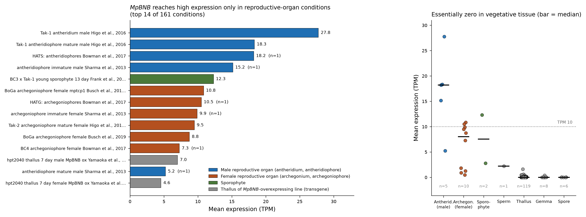
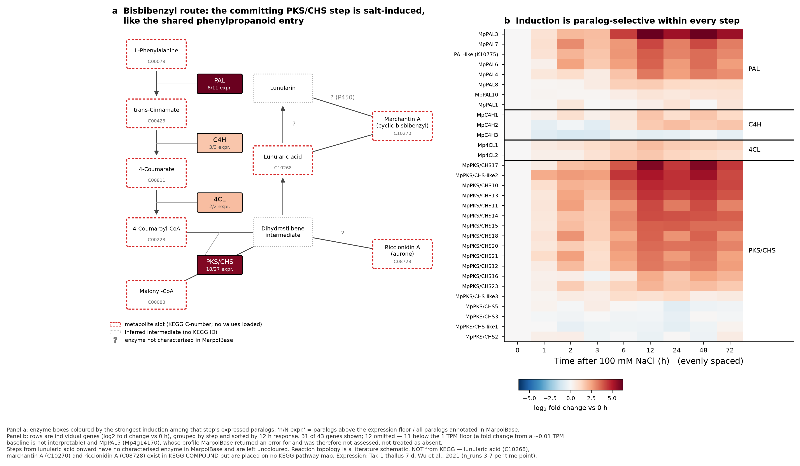

*本稿は BioHackrXiv 提出版 `paper.md` の日本語版である。*

# はじめに

本プロジェクトでは、ゆるやかに関連する二つの目標に取り組んだ。

一つめは、ゼニゴケ (*Marchantia polymorpha*; Bowman et al., 2017) のゲノムデータベース
**MarpolBase** (Tanizawa et al., 2025) を知識ベース化することである。具体的には、遺伝子・発現・文献のデータを RDF として公開し、
SPARQL エンドポイントを通じて提供し、さらに Model Context Protocol (MCP) サーバを介して
AI エージェントから利用できるようにした。

二つめは、**DDBJ への登録コスト**を下げることである。DDBJ 登録ファイルの作成は依然として
手作業に頼る部分が大きい。ここで報告する二つのサイドプロジェクト — DFAST-Agent と MARKit —
は、この問題に二つの方向から取り組むものである。前者は対話を通じて登録ファイルを組み立てる
エージェントであり、後者は登録ファイルを機械的に生成・点検するツールである。

本ハッカソンで作成したリソースとツールを表 1 に示す。

表 1: BioHackathon 2026 で開発・拡張したリソースとツール

| 名称 | URL | 説明 |
| ---- | --- | ---- |
| MarpolBase RDF | <https://marchantia.info/rdf/> | MarpolBase の遺伝子・発現・文献データの RDF 配布 |
| MarpolBase SPARQL エンドポイント | <https://marchantia.info/sparql> | 公開エンドポイント。TogoMCP と RDF Portal に登録済み |
| MarpolBase MCP サーバ | <https://marchantia.info/mcp> | 遺伝子・発現・共発現・文献への型付きアクセスを提供する 14 ツール |
| DFAST-Agent | 未公開 | DDBJ 登録ファイルを組み立てるエージェントの試験的なプロトタイプ実装。原核生物ゲノム (DFAST API 経由) と真核生物ゲノム (GFF から) に対応。local LLM を用いた Web インターフェースも試作した |
| MARKit | <https://ggs-staging.ddbj.nig.ac.jp/tools/markit> | 系統マーカー配列の登録支援ツール。コンテナ `nigyta/markit:latest` |

# MarpolBase の RDF 化と MCP サーバ

## 公開したもの

MarpolBase が提供する遺伝子情報・発現情報・文献情報を RDF に変換して公開した。SPARQL
エンドポイントは TogoMCP と RDF Portal の双方に登録したため、国内で整備されている
データベース横断のクエリ環境から MarpolBase に到達できるようになった。さらにエンドポイントの
上に 14 個のツールを持つ MCP サーバを構築し、LLM エージェントが SPARQL を自分で書かずに
このリソースを検索できるようにした。

ツールは大きく五つに分かれる。遺伝子の取得と検索、発現プロファイルと条件間比較、共発現
ネットワーク、キュレーション済みの遺伝子–文献リンク、統制語彙の解決である。型付きツールで
足りない場合に備えて `run_sparql` と `describe_schema` も用意し、エージェントが生の SPARQL に
フォールバックできるようにしてある。

## 使用例

自然言語のプロンプトのみで駆動する二つの解析でサーバを検証した。

一つめ (図 1) では、「MpBNB 遺伝子が高発現している条件を教えて」というプロンプトに対し、
MarpolBase の全 161 条件における `MpBNB` の平均 TPM を、条件属性 (組織・系統・ステージ・
性・変異体・処理・感染) とともに取得して回答した。この遺伝子は造精器で 27.8 TPM に達する
一方、葉状体・無性芽・胞子ではほぼゼロである。発現値がサンプル ID ではなく条件メタデータを
伴っているため、エージェントがこのようにまとめて報告できる。

二つめ (図 2) では、塩ストレス下におけるビスビベンジル合成経路を追跡した。発現値は
MarpolBase から取得し、代謝経路の文脈 — 化合物 ID、反応、酵素の参照 — は TogoMCP を介して
外部リソースから取得した。律速となる PKS/CHS ステップと、共通のフェニルプロパノイド入口は
ともに塩誘導性であり、しかもどのステップでも誘導はパラログ選択的であった。

## MarpolBase と TogoMCP それぞれの役割

この二つの解析を通じて、種特異的リソースとデータベース横断ハブの役割分担が具体的に見えた
(表 2)。

MarpolBase にしかできないのは、161 条件の実測発現量、共発現ネットワーク (PCC / HRR / MR)、
DESeq2 による 2 条件間の差次発現、evidence と role を付してキュレーションされた遺伝子–文献
リンク、そして PECO・PO ID つきの統制語彙の解決である。加えて、独自の KEGG Orthology 付与を
持つ — `mpo:hasKEGG` で 6,563 遺伝子。この点は実務上重要だった。ゼニゴケは KEGG GENES に
存在しないため、図 2 の酵素ノードを着色できたのは、MarpolBase が自前で KO 番号を付与して
いるからに**他ならない**。

TogoMCP にしかできないのは、119 データベース間の ID 変換 (TogoID; Ikeda et al., 2022)、生物種横断の汎用参照
(UniProt、PDB、Reactome、Rhea、ChEMBL、MeSH) の検索、NCBI E-utilities 経由での SRA・GEO・
PubMed へのアクセス、そして複数エンドポイントを選択しての SPARQL 発行である。

表 2: 両者が重なる部分と、その質の違い

| 機能 | MarpolBase | TogoMCP |
| ---- | ---------- | ------- |
| SPARQL | 自前グラフ 1 つ (`GRAPH` の明示が必須) | 複数エンドポイントを選択可 |
| 文献 | ゼニゴケ論文と遺伝子の紐付け (evidence/role 付き) | PubMed / MeSH の汎用検索 |
| 化合物 | 扱わない | ChEBI / Rhea / PubChem の ID 変換 |
| 遺伝子発現 | 161 条件の実測値 | 持たない |

## 両者は遺伝子 ID では繋がらない

本プロジェクトで最も有用だった否定的な結果がこれである。**TogoID にゼニゴケの遺伝子
データセットは無く、MarpolBase の `get_gene` は UniProt アクセッションを返さない。**
したがって `Mp3g23300` を ID 変換で直接 TogoMCP 側へ渡す経路は存在しない。あわせて、
`pfam → uniprot` は TogoID の経路として存在しない (404) 一方、`rhea ↔ chebi`、
`chebi ↔ pubchem_compound`、`uniprot ↔ rhea`、`uniprot ↔ pdb`、`go ↔ uniprot` は存在する
ことを確認した。

両者が実際に出会うのは**共通語彙のレベル**である。

1. KO 番号 — 図 2 の二層マップを成立させた接点。
2. GO / Pfam — MarpolBase が付与し、TogoMCP 側で参照できる。
3. 化合物 ID (ChEBI / PubChem) — メタボロームデータとの接点。

代わりに UniProt を経由すると、タンパク質名と生物種による検索になるため、MpPAL1〜10 のような
パラログ群では多対多となり信頼できない。

実務上の指針としては次のようになる。ゼニゴケの測定値・条件・共発現・キュレーション文献を
知りたいときは MarpolBase を使う。その結果を構造・反応・化合物・他種のオーソログ・配列
アーカイブへ広げたいときは TogoMCP を使う。そして両者の橋渡しは、遺伝子 ID ではなく
KO・GO・化合物 ID で行う。

# サイドプロジェクト: DDBJ 登録支援ツール DFAST-Agent

DFAST-Agent は、AI エージェントによる DDBJ 登録ファイル作成支援ツールの試験的なプロトタイプ
実装である。このアプローチが成立するかを確かめるためにハッカソン中に構築したものであり、
公開されたツールではない。登録のための手順や converter を MCP サーバ・スキル・ツールとして
エージェントに提供する。エージェントは
DDBJ ユーザー向けの認証付きオブジェクトストレージ **Kura** 上のファイルを参照・操作し、
登録に必要なメタデータはユーザーとの対話を通じて収集する。

**原核生物用ツール。** 原核生物ゲノム用の DFAST API (Tanizawa et al., 2018) を用いて、Kura 上のファイルを DDBJ 登録
ファイルに変換した。ターミナル上での対話的な操作により、プロトタイプ上で登録ファイルの作成に
成功している。

**真核生物用ツール。** GFF ファイルから DDBJ 登録ファイルへの変換を実装した。ターミナル上での
エージェントとの対話により、必要なメタデータ情報の収集と登録用ファイルへの変換に成功した。
また AI エージェントを利用しないユーザーのために、遺伝研スパコン上で動く local LLM を
バックエンドとする Web インターフェースを開発し、Kura 上でのファイル操作による登録ファイル
作成を目指した。local LLM を使ったエージェントのチューニングが難しく、この構成でのファイル
変換は成功しなかったが、Kura の利用ノウハウを得ることができた。開発は継続中である。

# サイドプロジェクト: 系統マーカー登録用ツール MARKit

## 背景

COI、16S、ITS などのバーコード配列の登録は、1 提出に数百〜数千エントリが含まれる一方、
アノテーションは提出者の手作業に頼っている。そのため、座標のずれ、翻訳できない CDS、申告
学名と配列の不一致が登録後に見つかることがある。**MARKit** (Marker Annotation and
Registration Kit) は、FASTA と最小限のメタデータから DDBJ MSS 形式の登録ファイルを機械的に
組み立て、提出前に点検するツールである。

処理の流れは、マーカー判定 → 領域決定 → 構造検査 → 学名整合 → 登録ファイル生成 → レポート
である。

## 特徴

- **マーカーを申告に頼らず判定する。** 全モデル (HMM / CM) を当ててエントリごとに決めるため、
  1 提出にマーカーが混在していても分けて処理し、最後に 1 つの登録ファイルへ合流させる。
  対応マーカーは 22 種。
- **分類群に応じて遺伝暗号表を選ぶ。** ミトコンドリアの暗号表は分類群ごとに異なるため、申告
  学名から分類群を引いたうえで読み枠を評価する。
- **登録できない形を生成の段階で回避する。** 翻訳できない読み枠を CDS にしない、逆鎖は
  plus 鎖に揃えて座標を移す、など。
- **学名整合。** 参照 DB と配列を距離ベースで照合し、科ごとに較正した閾値で裁定する。申告
  学名が無い場合も候補を出すので、種名確定の材料になる。
- **メタデータが揃う前に解析できる。** FASTA だけで解析を実行し、後から登録ファイルを作れる。
- **解析結果を見てエントリ単位に指示できる。** 「登録から外す」「CDS / rRNA ではなく
  `misc_feature` / `misc_RNA` として登録する」を選択できる。
- **実登録データで検証している。** 実際に登録された提出 91 件・約 1 万エントリについて、生成
  結果を実登録の `.ann` と突き合わせ、機能追加のたびに検証している。
- **コンテナで配布。** 実行環境・参照データ・コードを同梱 (Apptainer 657 MB / OCI 4.7 GB、
  `nigyta/markit:latest` として公開)。

## Web インターフェースの開発

利用者を広げるため、既存の DDBJ Gene/Genome Submission (GGS) ツールに Web インターフェース
として組み込んだ (図 3、図 4)。MARKit 本体をコンテナとして呼び出す構成で、解析ロジックは
コマンドライン版と同一である。画面は INPUT / ANALYSIS / BIOLOGICAL SOURCE / COMMON /
BUILD & VALIDATE の 5 つからなり、複数の FASTA をそれぞれ異なるマーカー設定で解析できる。
画面は日英併記で、アップロードはすべてサーバ側で検証している。

## 現状

コマンドライン版は実運用で使える状態にあり、Web 版も 5 画面が通しで動作している。

# まとめ

MarpolBase を RDF 化することで、種特異的な植物ゲノムリソースを外部リソースと連動させることが
できた。またエンドポイントを TogoMCP と RDF Portal に登録することで、国内の共通基盤に植物
ゲノムリソースを提供できた。他のリソースにも当てはまる教訓は、表 2 とそれに続く節に書いた
とおりである。すなわち、主要な横断参照ハブが索引していない生物種を扱うリソースの場合、統合
の接点は遺伝子 ID ではなく、そのリソースが自ら付与することを選んだ共通語彙 — 本件では何より
独自の KO 付与 — である。

DDBJ 側については、DFAST-Agent と MARKit はいずれも登録作業の手作業を減らすものだが、開発段階
も前提とする条件も異なる。DFAST-Agent はまだプロトタイプであり、必要な情報を対話で集めるため
能力の高いエージェントに依存する
のに対し、MARKit は配列から導ける部分は自動で決め、本当に判断が必要な箇所だけを提出者に尋ねる。
local LLM での試みは、対話型のアプローチが現時点ではフロンティアモデル無しには再現しにくい
ことを示しており、決定的な経路を並行して保つことの根拠になっている。

## 参考文献

- Tanizawa Y, Mochizuki T, Yagura M, Sakamoto M, Fujisawa T, Kawamura S, Shimokawa E,
  Yamaoka S, Nishihama R, Bowman JL, Berger F, Yamato KT, Kohchi T, Nakamura Y.
  MarpolBase: genome database for *Marchantia polymorpha* featuring high quality
  reference genome sequences. *Plant and Cell Physiology* 2025;67(3):377-388.
  <https://doi.org/10.1093/pcp/pcaf159>
- Bowman JL, Kohchi T, Yamato KT, et al. Insights into Land Plant Evolution Garnered
  from the *Marchantia polymorpha* Genome. *Cell* 2017;171(2):287-304.e15.
  <https://doi.org/10.1016/j.cell.2017.09.030>
- Tanizawa Y, Fujisawa T, Nakamura Y. DFAST: a flexible prokaryotic genome annotation
  pipeline for faster genome publication. *Bioinformatics* 2018;34(6):1037-1039.
  <https://doi.org/10.1093/bioinformatics/btx713>
- Ikeda S, Ono H, Ohta T, et al. TogoID: an exploratory ID converter to bridge
  biological datasets. *Bioinformatics* 2022;38(17):4194-4199.
  <https://doi.org/10.1093/bioinformatics/btac491>

## 謝辞

DBCLS BioHackathon 2026 の主催者、および議論いただいた参加者の皆様に感謝する。本研究では
DBCLS が維持する TogoMCP と RDF Portal を利用した。
